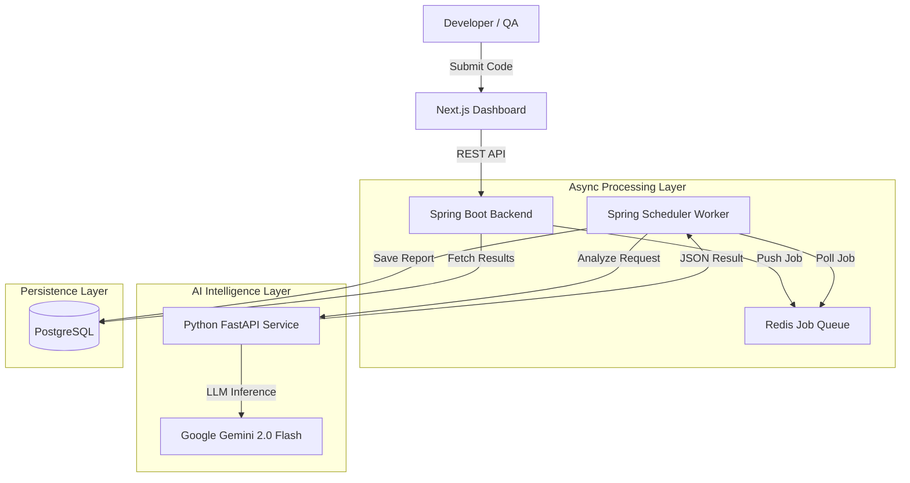

# CodeDrishti (v1.0)
### Enterprise-Grade AI Code Review & Quality Assurance Platform

[](https://spring.io/projects/spring-boot)
[](https://nextjs.org/)
[](https://fastapi.tiangolo.com/)
[](https://redis.io/)
[](https://www.postgresql.org/)
[](https://deepmind.google/technologies/gemini/)

---

## Project Overview

**CodeDrishti** is a distributed, AI-powered code analysis platform designed to automate code review, reduce technical debt, and accelerate QA cycles.

Built on a **Microservices Architecture**, it uses asynchronous communication between a **Spring Boot backend**, **Redis job queue**, and a **Python/FastAPI AI engine**. The system performs deep static analysis to detect bugs, OWASP security risks, and performance issues—while also generating unit tests and developer documentation.

This project demonstrates end-to-end integration of **Generative AI (LLMs)** inside a scalable developer workflow with a modern dashboard to visualize insights.

---

##  Demo & Walkthrough 


https://github.com/user-attachments/assets/1171b3c8-cf2b-4071-8dbf-c2ca4ee0f476


---

##  System Architecture

The system uses a fully **Event-Driven Architecture** for horizontal scalability and non-blocking execution.



---

##  Key Features (v1.0)

###  1. Automated Code Review
- Detects logical bugs, null pointer risks, and exception leaks.  
- Security analysis using LLM reasoning (OWASP Top 10).  
- Identifies performance bottlenecks using Big-O reasoning.

### 2. AI-Driven Test Automation
- Generates **JUnit** (Java) and **PyTest** (Python) unit tests.  
- Highlights edge cases and boundary conditions.  
- Provides risk scoring for sensitive sections.

###  3. Intelligent Documentation
- Auto-generates **Javadoc / Docstrings**.  
- Summarizes logic and identifies design patterns.

### 4. Static Quality Scoring
- Computes a 0–100 **Quality Score** based on:
  - Maintainability  
  - Cyclomatic Complexity  
  - Code smells & duplication  
  - Security flags  

### 5. Distributed Job Queue
- Redis-powered async processing keeps the API responsive under load.  

---

##  Tech Stack

| Component | Technology | Description |
|---|---|---|
| **Frontend** | Next.js 14, TypeScript | Modern dashboard with RSC & App Router |
| **UI** | Tailwind CSS, shadcn/ui | Clean, accessible component system |
| **Backend Core** | Java 17, Spring Boot 3 | REST APIs, JPA, scheduler worker |
| **AI Engine** | Python, FastAPI, LangChain | LLM integration & analysis pipeline |
| **Queue** | Redis | Distributed job queue |
| **Database** | PostgreSQL | JSONB-based reports & audit logs |
| **AI Model** | Gemini 2.0 Flash | High-speed, large-context LLM |

---

## Installation & Setup

### Prerequisites
- Java 17+
- Node.js 18+
- Python 3.10+
- Docker (Optional but recommended)
- Google Gemini API Key

---

###  Start Infrastructure (Redis + PostgreSQL)

```bash
docker run --name redis -p 6379:6379 -d redis

docker run --name postgres-db \
  -e POSTGRES_USER=postgres \
  -e POSTGRES_PASSWORD=postgres \
  -e POSTGRES_DB=aicodereview \
  -p 5432:5432 -d postgres
```

---

###  Setup AI Engine (Python/FastAPI)

```bash
cd ai-engine
python -m venv venv
source venv/bin/activate       # Windows: venv\Scripts\activate
pip install -r requirements.txt

# Add GOOGLE_API_KEY in .env
uvicorn app.main:app --reload --port 8000
```

---

###  Run Backend Core (Spring Boot)

```bash
cd backend-core
mvn clean spring-boot:run
```

---

### Launch Frontend Dashboard (Next.js)

```bash
cd frontend-dashboard
npm install
npm run dev
# Open http://localhost:3000
```

---

## Future Roadmap (v2.0+)

- **Full CI/CD Integration** (GitHub Actions, GitLab CI)  
- **PR-level Diff Analysis** for faster reviews  
- **Inline GitHub Comments** using bot automation  
- **Team & Role Management (RBAC)**  
- **Historical Code Quality Trends Dashboard**  
- **Multi-language Support:** Go, JavaScript, Kotlin  

---

## Author

**Ujjwal Kumar Singh**  
*Backend Engineer • Full Stack Developer • AI Engineer*  

[LinkedIn](https://www.linkedin.com/in/ujjwalks9/) ·  
[Email](mailto:ujjwal.ksingh21@gmail.com)

---

### If you like this project, consider giving it a star on GitHub!

*Built with ❤️ using Spring Boot, Next.js & Generative AI.*


